# ridelectric.pl
> It's Website present Photovoltaic installation Offers and e-store with electromobility 
> and photovoltaics components, connecting with MySQL Data Base.

## Table of contents
* [General info](#general-info)
* [Technologies](#technologies)
* [Instruction](#instructions)
* [Live View](#live-view)
* [Status](#status)
* [Contact](#contact)

## General info
Project presents Website with description  of why it's worth to have photovoltaic installation and kind
 of installations. Also Internet store with products of photovoltaic and electromobility parts

## Technologies
* Python - version 3.8
* Python Django - version 3.0.6
* Django REST Framework
* HTML/CSS/Bootstrap
* JavaScript 
* MySQL

## Instructions
#### Tab home contains carousel with link to "Photovoltaic installation", e-store and contact tabs.
#### Tab About short description of company, e-shop and photowoltaic installation offer
#### Tab "Photovoltaic installation" more precise description of offer, like type of installation
#### Tab Shop is supply with a full of functional online store (e-shop):
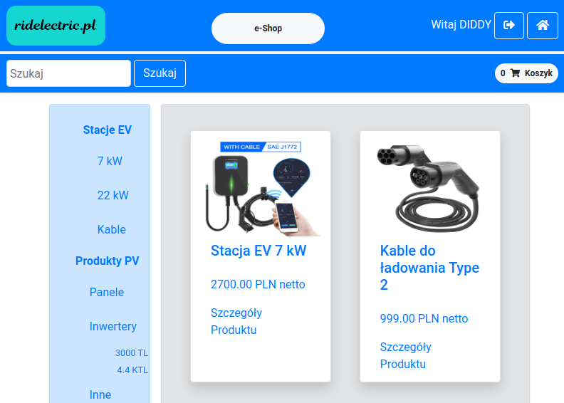
#### Create Base Categories in admin panel:
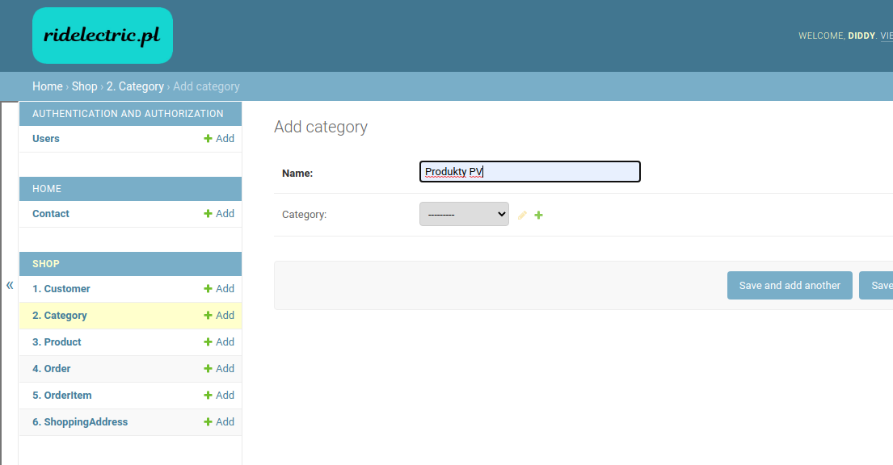

#### So you can view them in template:
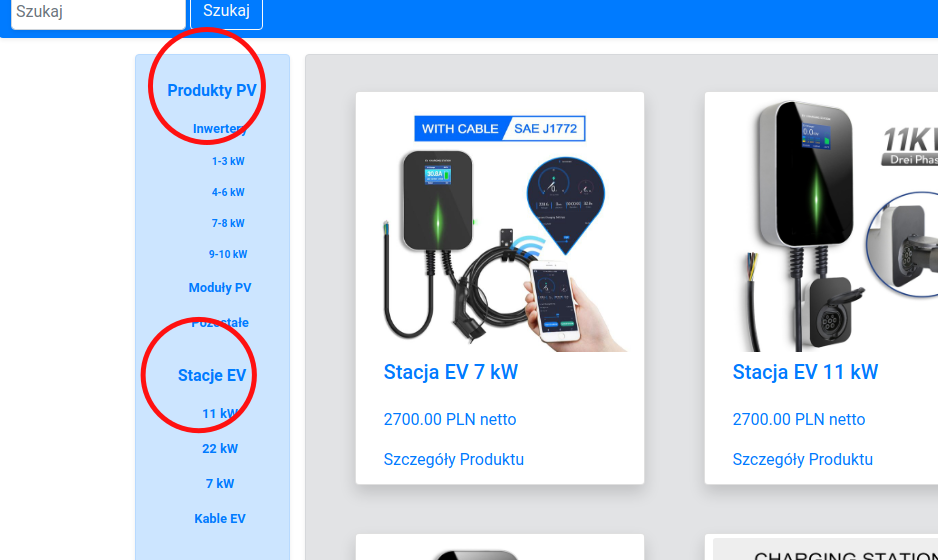
#### Than create categories:
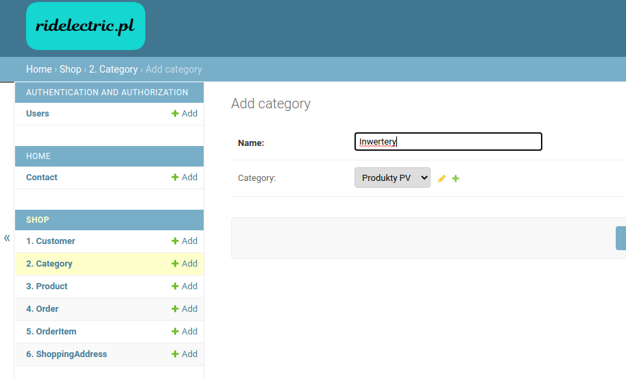

#### View in template:
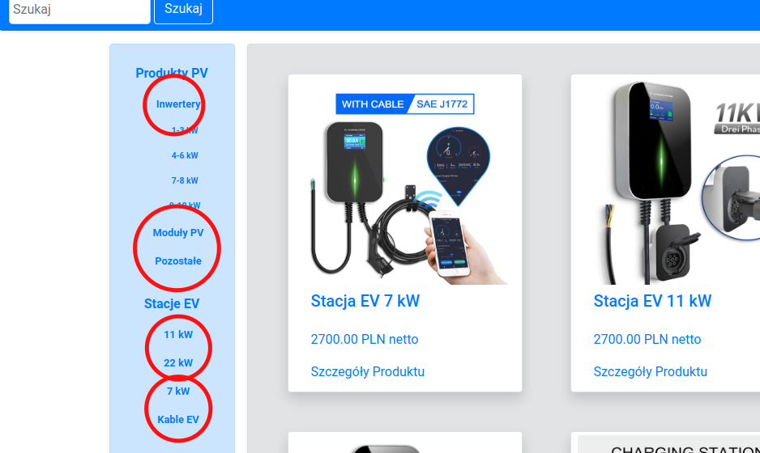
#### You can create subcategory also:
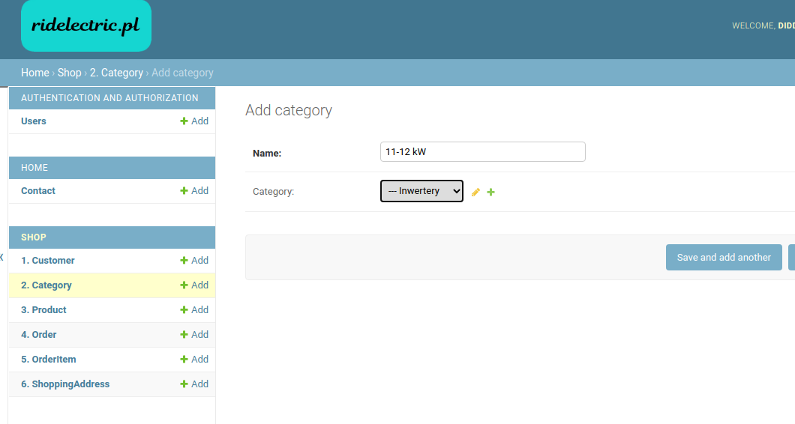

#### View in teamplate:
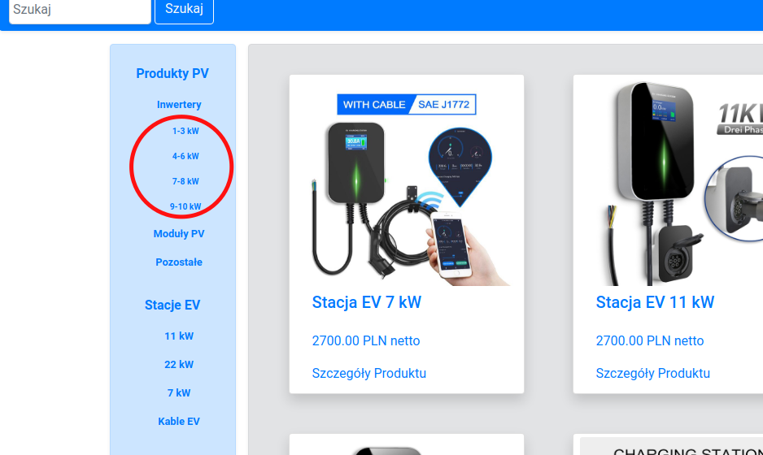

#### Your categories in admin panel
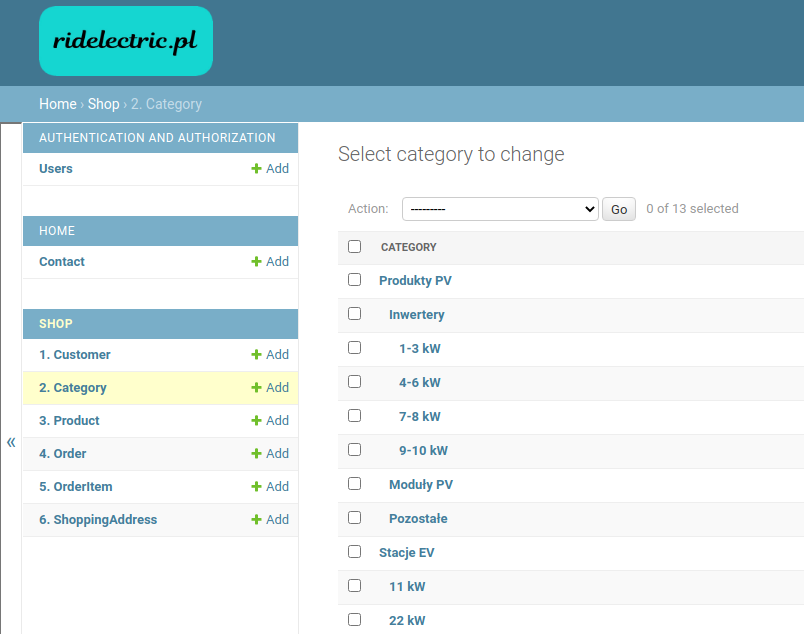

#### Add some product to your shop - use created base category, category or subcategory:
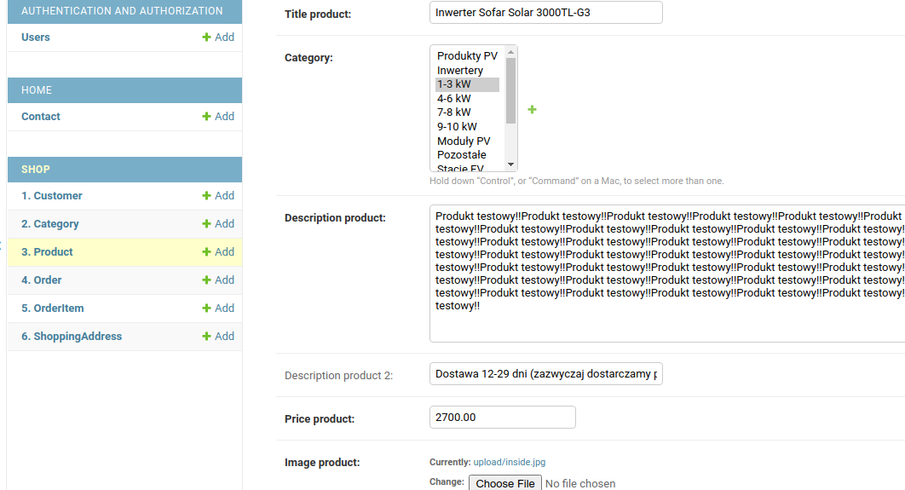
#### Register as user, and login:
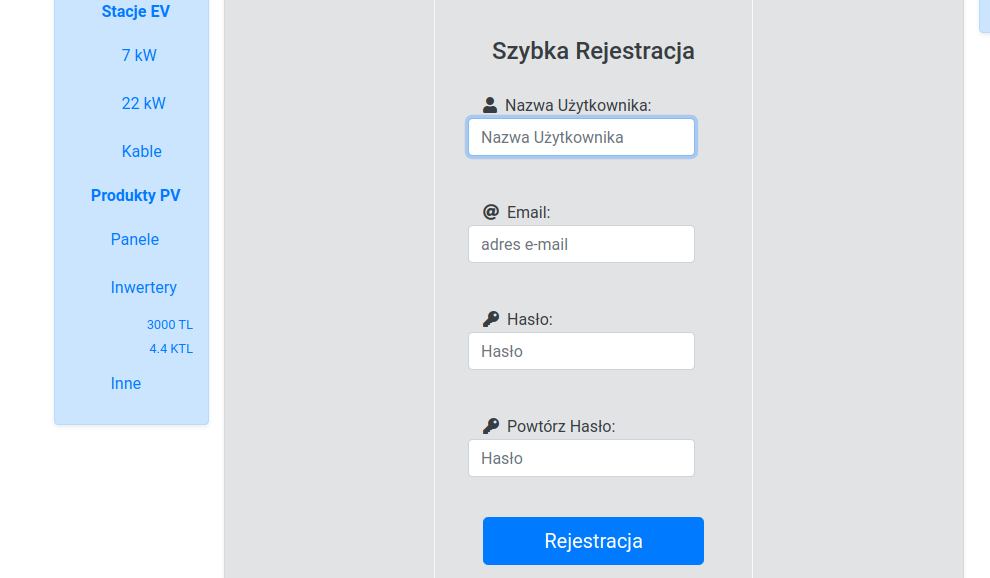

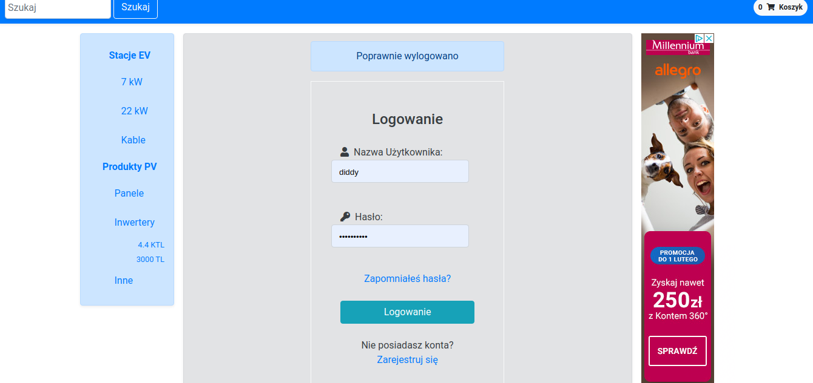
#### Add products to Cart and go to payment:
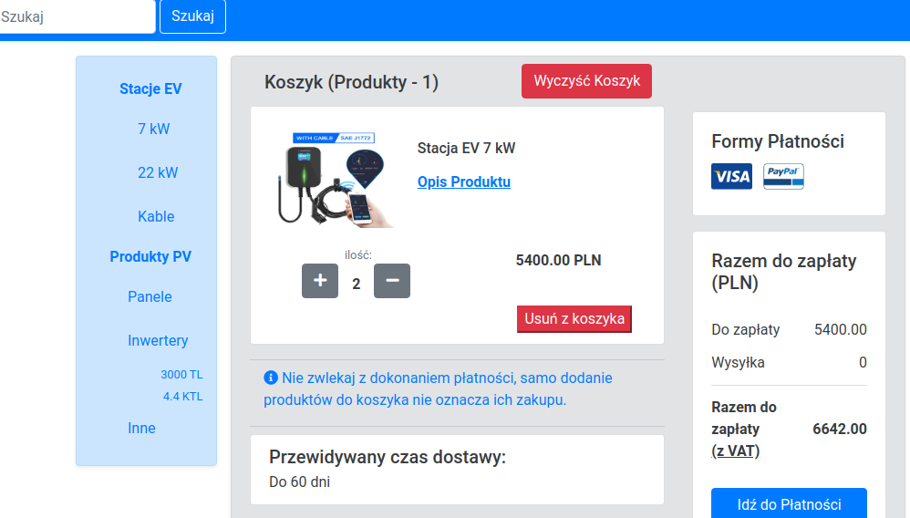
#### Check API user:
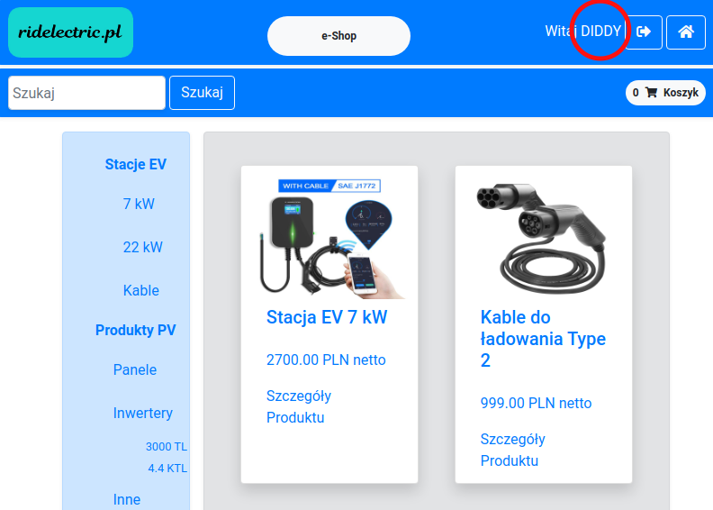
#### Detail API - user info:
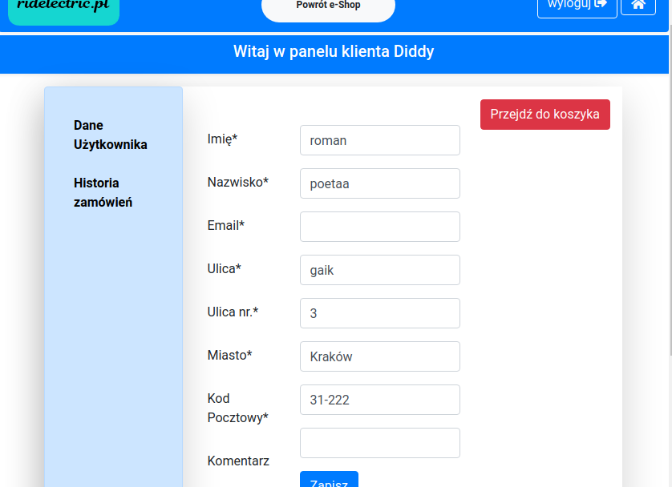
#### Detail API - order history:
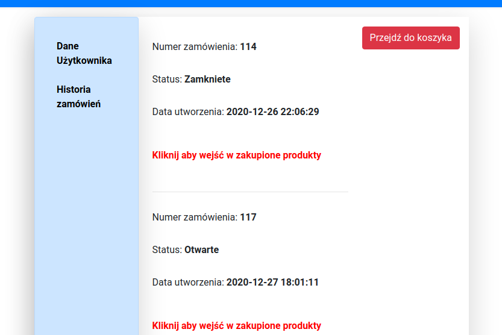
#### Includes Navigation bar on left site, with categories of products, 
#### searching option on left site of bar, and shopping cart on right.
#### Middle container contains list of product, after click showing detail - description of product,

#### Tab Contact contains simple contact form using database, with obligatory Firstname form, Email
#### and Question form. Forms Surname and Company are optional.The contact form contains options
####  for sending copy of the form to the email address. Also contains contact details

## Live View
Live view available on (www.ridelectric.pl/)

## Status
Finish

## Contact
Created by [DiddyChriss] (http://chriss.pythonanywhere.com/) - feel free to contact me!
